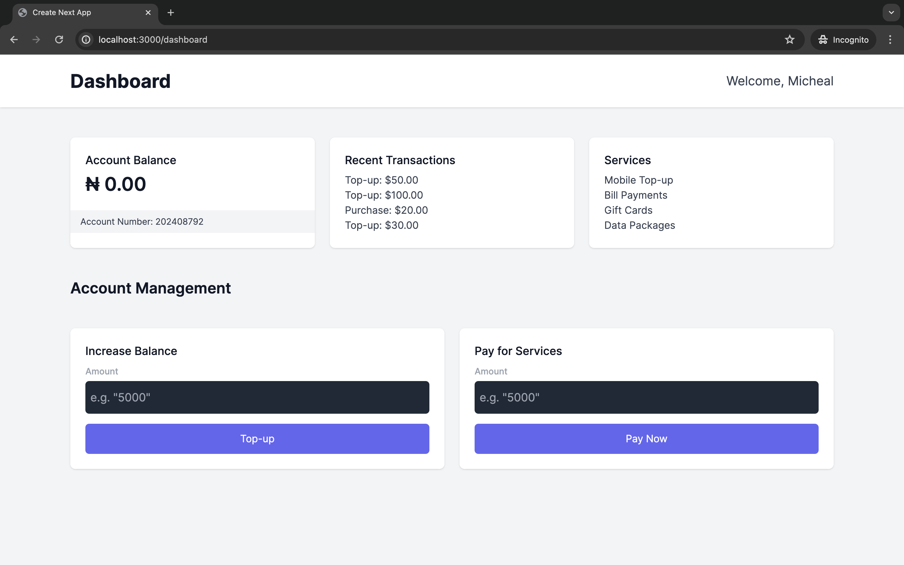
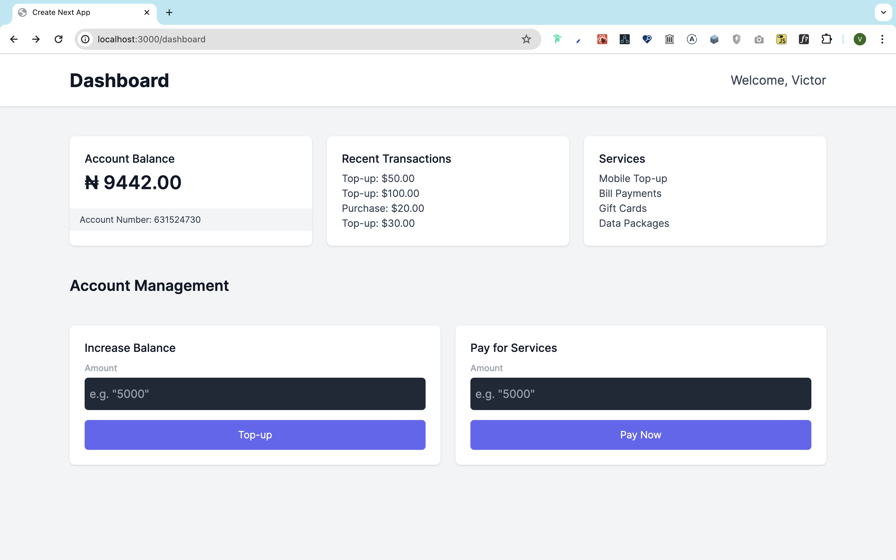

# Virtual Account Proof of Concept (POC)

This project is a proof of concept (POC) demonstrating how virtual accounts work and how to connect your application to virtual account providers. The focus of this POC is the Nigerian market.

## Overview

Virtual accounts are a powerful tool for businesses, allowing for seamless and secure transactions. This POC explores the integration of these accounts into an application, specifically focusing on providers like Paystack.

## Features

- Naive demonstration of how virtual accounts function
- Naive fund addition into the wallet
- Naive fund withdrawal from the wallet, when a user pays for a service

## What is a Virtual Account?

Virtual Accounts (VAs) is a feature that lets you create Nigerian bank accounts for your users. These accounts allow your users to carry out different transactions on your business.

When you create a Virtual Account (VA) for a user, all bank transfers to that account will automatically be recorded as transactions from that user.

## Why Virtual Accounts?

Virtual Accounts are a great way to manage your users' funds. They allow you to create a bank account for each user, which makes it easier to track their transactions and provide a wallet like services.

## How to Use

1. Clone the repository
2. Run `pnpm install` to install the dependencies
3. Run `pnpm dev` to start the development server
4. You will need a postgres database setup

## UI

